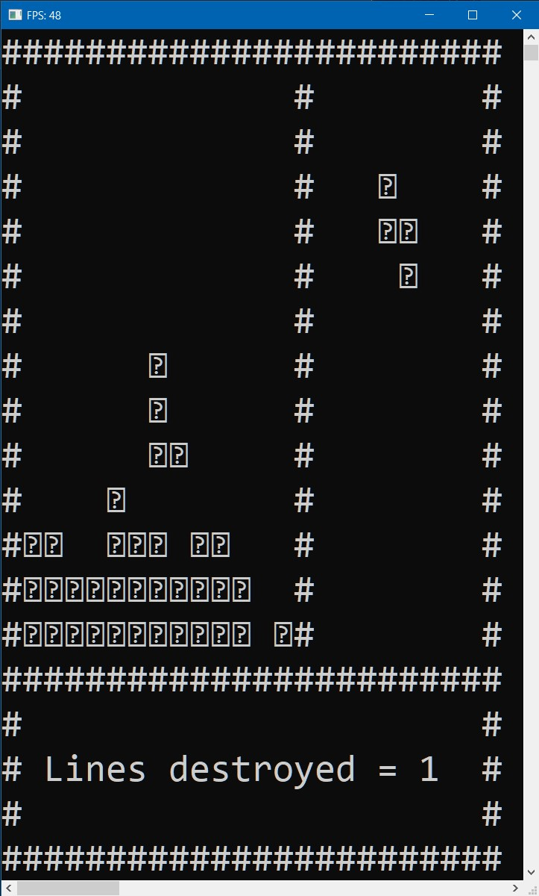

# Tetris for CMD by IRONKAGE [Nordcurrent]

Visual Studio Community 2017 V15.9.26/Puzzle/CMD/PC

  

## About Game

🎲 Task: Write Tetris.

1. Convert for MVS 2017;
2. Use Class BaseApp;
3. Presence of a Preview of the next Figure;
4. Implement Control;
5. The Width of the Playing Field - 15 Characters;

🎮 Mechanics for CMD:

- ***Key Down, s, S*** -> **Accelerate the figure**
- ***Key Right, d, D*** -> **Turn the Figure to the Right**
- ***Key Left, a, A*** -> **Turn the Figure to the Left**
- ***Space*** -> **Rotation of the Figure**

🍭 Game description: In [Tetris](https://en.wikipedia.org/wiki/Tetris), players must complete lines by moving differently shaped pieces (tetrominoes), which descend onto the playing field. The completed lines disappear and grant the player points, and the player can proceed to fill the vacated spaces. The game ends when the playing field is filled.

## Images



## Tasks in the original language

```Rus
Задание:
На основе примера из папки src_sample реализовать игру тетрис.
Обязательным условием является использование класса BaseApp данного примера.
BaseApp позволяет производить графический вывод работы программы, обрабатывать клавиатуру и организовать главный цикл программы.
Реализованую демонстрацию тетриса можно посмотреть в папке tetris_sample.

Обязательнные требования:

1. Наличие превью следующей фигуры
2. Управление (стрелки влево/вправо), ускорение фигуры( стрелка вниз ), поворот фигуры( пробел )
3. Ширина игрового поля - 15 символов
4. Размер окна должен быть достаточным, чтобы вмещалось визуально все игровое поле.
```
